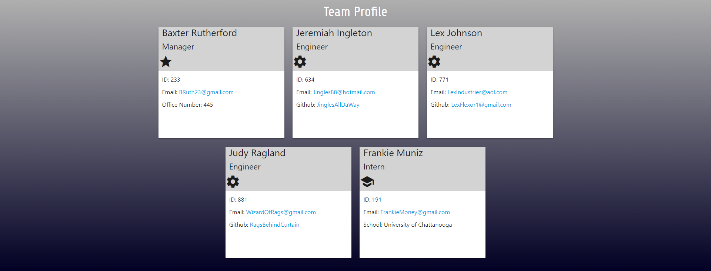

# 10 Team Profile Generator (Module 10 Challenge)

## Description

A simple CLI node application that helps you build an employee team page.  Quickly generate an HTML template with information gathered from user inputs for a Manager, Engineers and Interns.  

## Table of Contents

- [Installation](#installation)
- [Usage](#usage)
- [Credits](#credits)
- [License](#license)

## Installation

Install the node packages with "npm i" within the application directory.
Also, install the inquirer package to correcly run the user prompts with "npm i inquirer@8.2.4"
Run the application with "node index" in the terminal command line.

## Usage

Preview of website layout and design.

## Credits

Materialize for some beautiful designs.
https://materializecss.com/

Node.js for its CLI capabilities
https://nodejs.org/en/

## License

Please refer to the LICENSE in the repo.

---